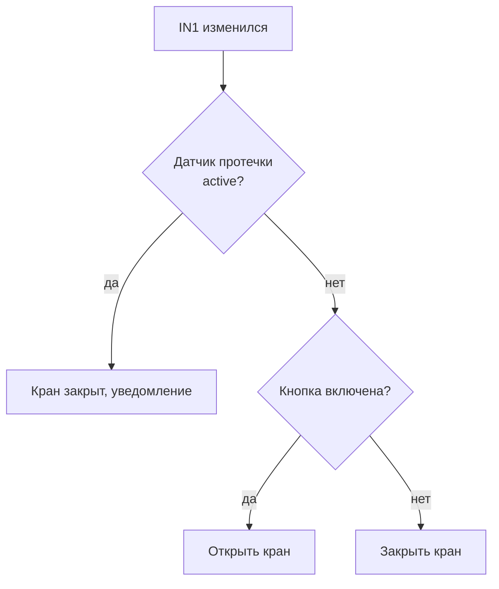
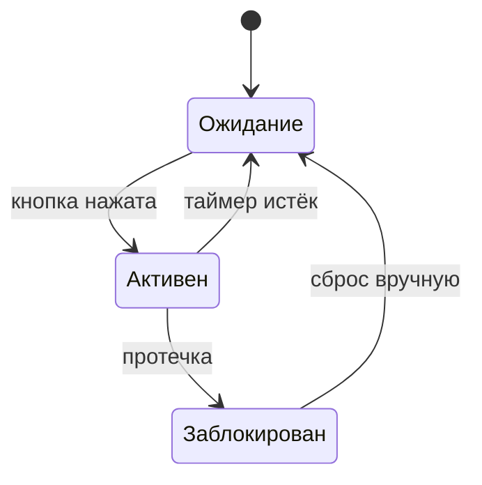
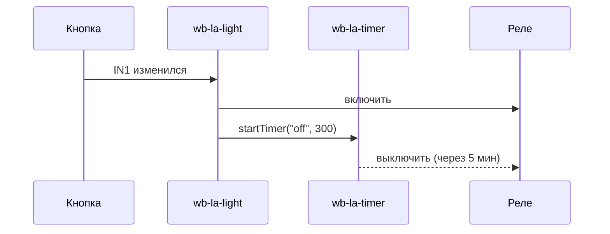

# Диаграммы и визуализация

Веб-чат поддерживает рендеринг Mermaid-диаграмм. Используй их чтобы показать **как работает** автоматизация до написания кода.

## Когда использовать диаграмму

- **Перед написанием правила** — покажи логику до кода: что проверяется, что происходит
- **При конфликте правил** — покажи, в каком состоянии какое правило «победит»
- **Для объяснения состояний** — если устройство проходит несколько состояний
- **Для цепочек событий** — если одно правило публикует в MQTT, другое на это реагирует

## Выбор типа

| Ситуация | Тип |
|---|---|
| Переходы между состояниями, флаги, режимы | `stateDiagram-v2` |
| Логика «если X то Y» с ветками | `flowchart TD` |
| Взаимодействие нескольких правил/устройств | `sequenceDiagram` |
| Простая таблица состояний | Markdown-таблица |

**Правило выбора:** если понятнее объяснить таблицей — используй таблицу, если нужно показать «поток» или переходы — диаграмму. Не используй диаграмму ради диаграммы.

## Примеры

### Логика нового правила (flowchart)



### Переходы состояний устройства (stateDiagram)



### Взаимодействие правил (sequenceDiagram)



### Таблица конфликтов (Markdown)

```
Вход A        | Датчик B    | Правило 1 хочет | Правило 2 хочет | Результат
──────────────────────────────────────────────────────────────────────────────
OFF → ON      | inactive    | реле вкл        | —               | реле вкл ✓
OFF → ON      | active      | реле вкл        | реле выкл       | КОНФЛИКТ ✗
ON → OFF      | active      | реле выкл       | реле выкл       | реле выкл ✓
```

## Ограничения

- Кириллица в узлах поддерживается.
- Кавычки внутри меток: используй `"` или `'`, не смешивай.
- Сложные диаграммы (много узлов) могут быть нечитаемы — упрощай.

## Формат ответа при проектировании правила

1. **Таблица каналов** — что читает, что пишет, тип (switch/value/etc)
2. **Диаграмма или таблица состояний** — логика нового правила
3. **Таблица конфликтов** — только если есть существующие правила на тех же каналах
4. Вопрос «такое поведение?» — дождись подтверждения, потом пиши код
