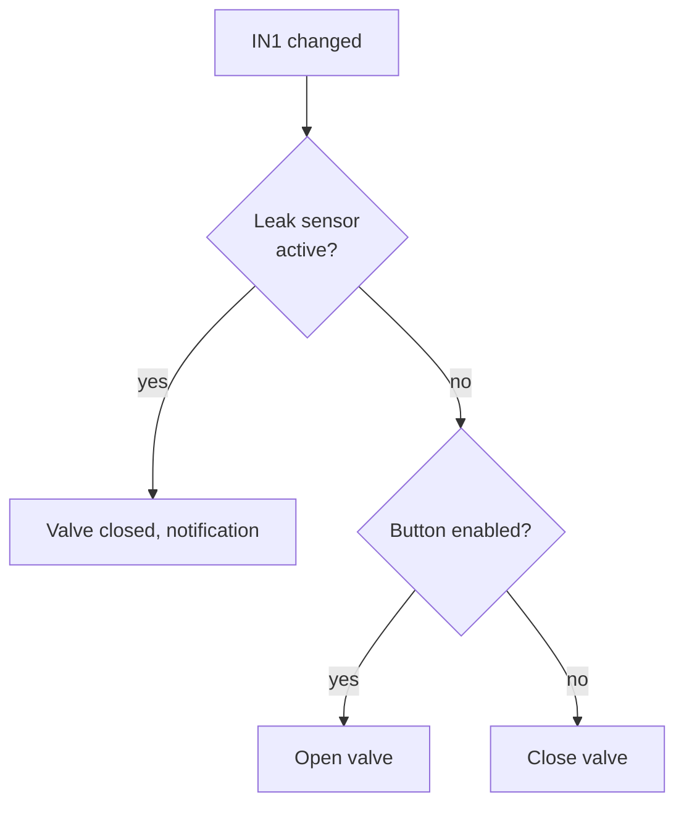
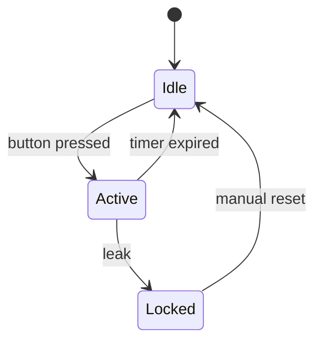
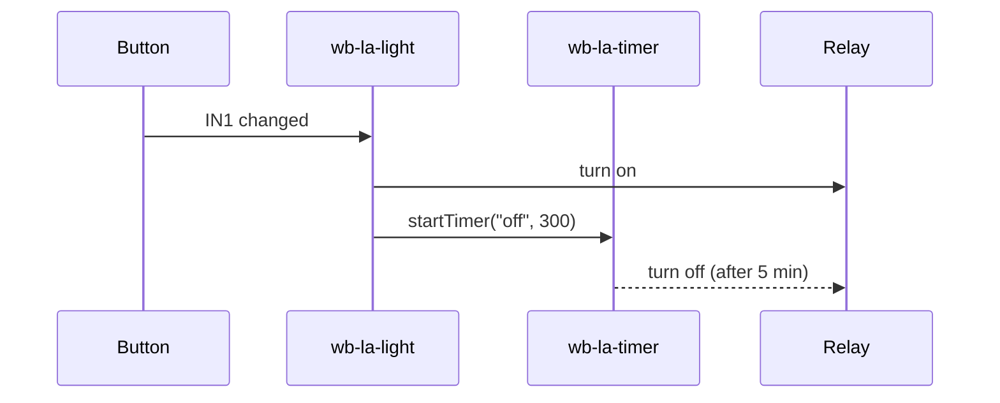

# Diagrams and visualization

Load this for ANY request to draw a diagram, schematic, relationship graph, architecture, flow, or mermaid: "draw a diagram", "build a schematic", "show dependencies", "mermaid", "flowchart", "zigbee2mqtt dependency diagram", "relationship diagram", "architecture", "sequence", "state machine", "visualize". The web chat supports rendering Mermaid diagrams — use them to show **how** an automation / relationships / architecture work before writing code.

## When to use a diagram

- **Before writing a rule** — show the logic before the code: what is checked, what happens
- **On a rule conflict** — show which rule "wins" in which state
- **To explain states** — if a device goes through several states
- **For event chains** — if one rule publishes to MQTT and another reacts to it

## Choosing a type

| Situation | Type |
|---|---|
| Transitions between states, flags, modes | `stateDiagram-v2` |
| "If X then Y" logic with branches | `flowchart TD` |
| Interaction of several rules/devices | `sequenceDiagram` |
| Simple state table | Markdown table |

**Selection rule:** if it's clearer to explain with a table — use a table; if you need to show a "flow" or transitions — use a diagram. Don't use a diagram for the sake of a diagram.

## Examples

### Logic of a new rule (flowchart)


```mermaid
flowchart TD
    A[IN1 changed] --> B{Leak sensor\nactive?}
    B -- yes --> C[Valve closed, notification]
    B -- no --> D{Button enabled?}
    D -- yes --> E[Open valve]
    D -- no --> F[Close valve]
```

### Device state transitions (stateDiagram)


```mermaid
stateDiagram-v2
    [*] --> Idle
    Idle --> Active : button pressed
    Active --> Idle : timer expired
    Active --> Locked : leak
    Locked --> Idle : manual reset
```

### Rule interaction (sequenceDiagram)


```mermaid
sequenceDiagram
    participant Button
    participant wb-la-light
    participant wb-la-timer
    participant Relay

    Button->>wb-la-light: IN1 changed
    wb-la-light->>Relay: turn on
    wb-la-light->>wb-la-timer: startTimer("off", 300)
    wb-la-timer-->>Relay: turn off (after 5 min)
```

### Conflict table (Markdown)

```
Input A       | Sensor B    | Rule 1 wants    | Rule 2 wants    | Result
──────────────────────────────────────────────────────────────────────────────
OFF → ON      | inactive    | relay on        | —               | relay on ✓
OFF → ON      | active      | relay on        | relay off       | CONFLICT ✗
ON → OFF      | active      | relay off       | relay off       | relay off ✓
```

## Limitations

- Cyrillic in nodes is supported.
- Quotes inside labels: use `"` or `'`, don't mix them.
- Complex diagrams (many nodes) can be unreadable — simplify them.

## Response format when designing a rule

1. **Channel table** — what it reads, what it writes, type (switch/value/etc)
2. **Diagram or state table** — the logic of the new rule
3. **Conflict table** — only if there are existing rules on the same channels
4. The question "is this the behavior you want?" — wait for confirmation, then write the code
